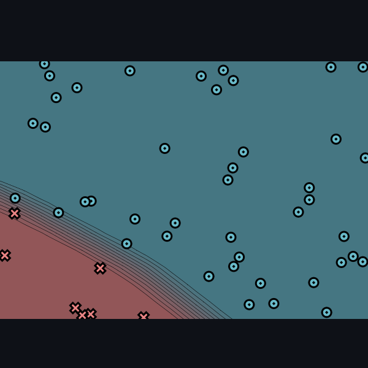
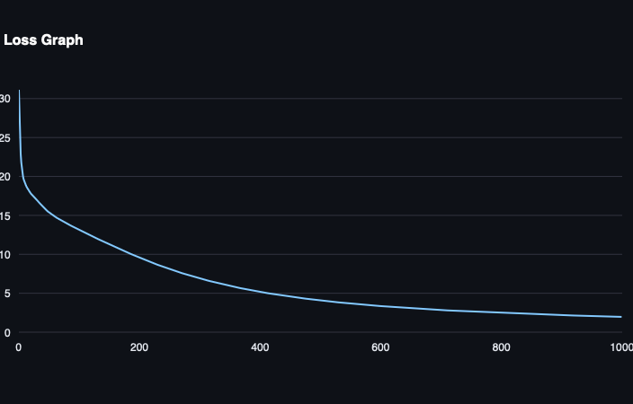
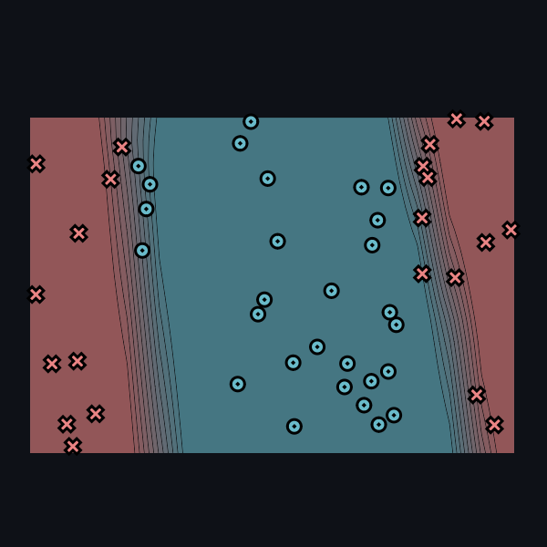
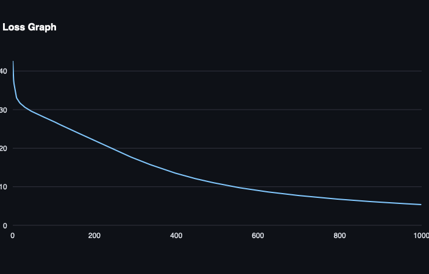
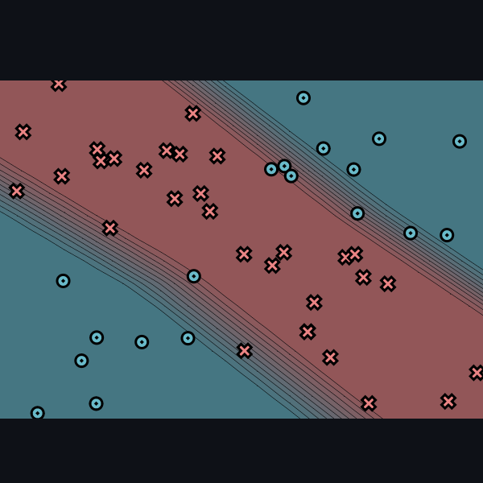
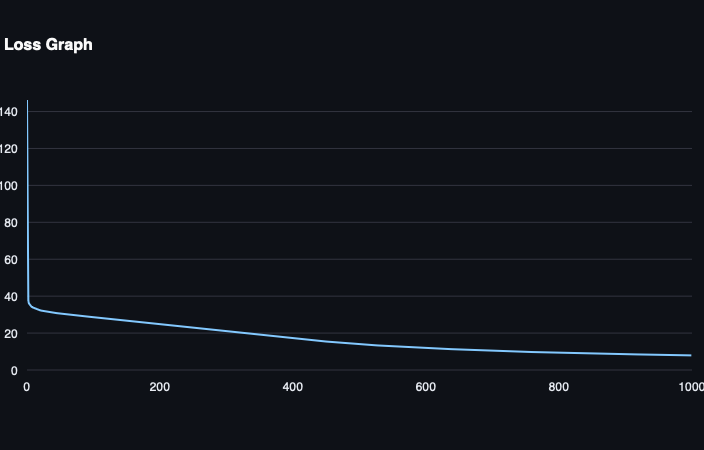

[](https://classroom.github.com/a/YFgwt0yY)
# MiniTorch Module 2


* Docs: https://minitorch.github.io/

* Overview: https://minitorch.github.io/module2/module2/

This assignment requires the following files from the previous assignments. You can get these by running

```bash
python sync_previous_module.py previous-module-dir current-module-dir
```

The files that will be synced are:

        minitorch/operators.py minitorch/module.py minitorch/autodiff.py minitorch/scalar.py minitorch/scalar_functions.py minitorch/module.py project/run_manual.py project/run_scalar.py project/datasets.py

---

# Experiment Results

## Dataset: Simple
**Settings:**
- Number of Points: 50
- Size of Hidden Layers: 5
- Learning Rate: 0.05
- Number of Epochs: 1000

### Epoch Data

| Epoch | Loss               | Correct |
|-------|---------------------|---------|
| 10    | 34.274252296769795  | 31      |
| 20    | 33.91584919098648   | 31      |
| 50    | 32.91685543495436   | 31      |
| 100   | 31.942124225864422  | 31      |
| 200   | 28.23000582773265   | 35      |
| 300   | 19.329039886132204  | 48      |
| 400   | 9.671141311590388   | 49      |
| 500   | 4.905388450687159   | 50      |
| 1000  | 1.0533713312016728  | 50      |

Time per epoch: 0.140s

### Result Graph


### Loss Function Graph


---

## Dataset: Diag
**Settings:**
- Number of Points: 50
- Size of Hidden Layers: 10
- Learning Rate: 0.05
- Number of Epochs: 1000

### Epoch Data

| Epoch | Loss               | Correct |
|-------|---------------------|---------|
| 10    | 19.347845258443577  | 43      |
| 20    | 17.890135911189837  | 43      |
| 50    | 15.437896686682864  | 43      |
| 100   | 13.17943170924022   | 43      |
| 200   | 9.604177046297476   | 43      |
| 300   | 6.921960968827461   | 47      |
| 400   | 5.184393127872349   | 48      |
| 500   | 4.08376928450071    | 49      |
| 1000  | 1.965745563984375   | 50      |

Time per epoch: 0.372s

### Result Graph


### Loss Function Graph


---

## Dataset: Split
**Settings:**
- Number of Points: 50
- Size of Hidden Layers: 15
- Learning Rate: 0.05
- Number of Epochs: 1000

### Epoch Data

| Epoch | Loss               | Correct |
|-------|---------------------|---------|
| 10    | 33.14474466921484   | 32      |
| 20    | 31.559292082280294  | 35      |
| 50    | 29.394633505015808  | 35      |
| 100   | 27.02843564616674   | 42      |
| 200   | 22.00057145097753   | 44      |
| 300   | 17.257289542457023  | 45      |
| 400   | 13.483244471742701  | 48      |
| 500   | 10.850454020195542  | 48      |
| 1000  | 5.371090461166223   | 49      |

Time per epoch: 0.720s

### Result Graph


### Loss Function Graph


---

## Dataset: Xor
**Settings:**
- Number of Points: 50
- Size of Hidden Layers: 20
- Learning Rate: 0.05
- Number of Epochs: 1000

### Epoch Data

| Epoch | Loss               | Correct |
|-------|---------------------|---------|
| 10    | 33.808181969083634  | 35      |
| 20    | 32.36451586997944   | 37      |
| 50    | 30.59224429807969   | 35      |
| 100   | 28.626462327050746  | 35      |
| 200   | 24.793095520051907  | 40      |
| 300   | 20.81645794303515   | 44      |
| 400   | 17.05382468302207   | 45      |
| 500   | 13.974367470041322  | 47      |
| 1000  | 7.916069335192185   | 49      |

Time per epoch: 1.197s

### Result Graph


### Loss Function Graph



